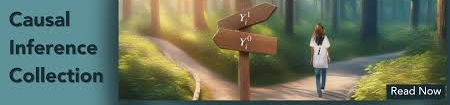

# Causal Inference Projects
Bayesian Structural Time Series (BSTS) & Observational Impact Analysis
This repository showcases applied Bayesian Structural Time Series (BSTS) projects focused on measuring real-world impact when randomized A/B testing is not feasible.

These projects demonstrate how to estimate causal effects for marketing campaigns, product launches, and operational changes using rich historical time series data — even when clean control groups or parallel trends assumptions do not hold.

Each project is built end-to-end:
from data ingestion and validation, to modeling and diagnostics, to impact estimation and business interpretation — with an emphasis on decision-ready insights rather than just statistical significance.

The goal is simple:

help teams make confident causal decisions under uncertainty.
